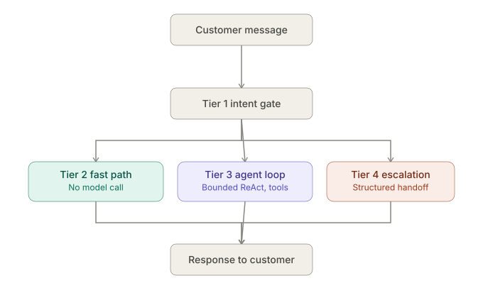
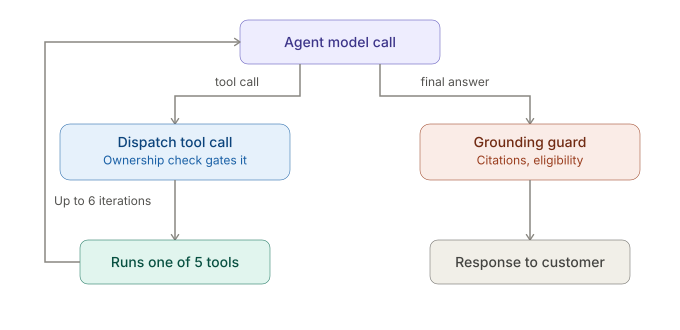

# Trendly Support Assistant — solution notes

## Architecture



Trendly handles roughly 2,000 support chats a day, and the large majority are
plain status checks — *where is it, when does it arrive, did it ship*. For
those the order record **is** the answer: there is nothing to retrieve and
nothing for a 70B-class model to reason about. Running every message through
one uniform agent loop would mean paying retrieval and 70B inference on the
cheapest, most repetitive traffic in the queue. So the architecture routes
around that cost rather than absorbing it.

Named plainly, the orchestration is a **router pattern wrapping a bounded
ReAct loop**. At the top level tier 1's classifier dispatches each message
down exactly one of four paths — that is the router. Inside tier 3, and only
there, the model reasons between tool calls and iterates until it has an
answer or hits `max_tool_iterations` — that is the ReAct loop, bounded. It is
not a sequential chain, and there is no planner: nothing decomposes a request
into steps ahead of time.

Every message hits a cheap classifier first, then takes one of four paths.

**Tier 1 — the intent gate.** One call to a small model
(`openai/gpt-oss-20b`, temperature 0, JSON mode) that classifies the message
into one of six intents and extracts an order ID if the message contains one.
This is a model call rather than keyword rules on purpose: *"it never showed
up"* and *"where is it"* share no keyword, and rules over phrasing break the
first time a customer writes something unanticipated. It fails closed — any
exception, any unrecognised intent, routes to `ambiguous`, which asks a
question rather than guessing. A router that guessed `order_status` while the
model was unavailable would answer confidently from a half-built context.

**Tier 2 — the templated fast path.** `order_status` with a known order and a
status the record fully answers (`in_transit`, `delivered`, `cancelled`,
`partially_shipped`) is rendered from a template. **No agent-model call and
no retrieval.** Precisely: tier 1's small-model classification has already
happened, so the path is cheap rather than free — what it skips is the 120B
model and the index. This is where the cost argument is actually collected. Statuses
whose correct answer depends on policy are deliberately excluded — `delayed`
and `lost_in_transit` need more than the record, so they fall through.

One thing is decided here rather than downstream: if the order record comes
back with `requires_human` set — currently only `lost_in_transit` — the
handoff is staged **in code**, before the model gets a turn. See the
structural-guardrails trade-off below for why.

**Tier 3 — the bounded agent loop.** Anything needing policy or eligibility
reasoning gets the 120B model with four tools (`get_order_status`,
`check_return_eligibility`, `search_policy`, `escalate_to_human`), capped at
six tool iterations. The cap matters more than it looks: a model that cannot
find a fact will keep re-querying with slightly different wording until it
times out, and with a cap, exhausting the budget is itself a signal that the
question needs a human rather than another attempt.



Both diagrams share one colour legend, so the meaning carries from the
overview into the zoom-in without being re-learned: **purple** for model
reasoning, **teal** for a cheap or deterministic path, **coral** for a safety
or grounding checkpoint, **grey** for neutral start and end points.

On the cap itself, honestly: six was chosen as a round number early in the
build, not derived from data. The heaviest turns actually observed —
eligibility plus staging a return — use four tool calls, so six leaves
headroom without being unbounded. It is a defensible default rather than a
tuned one, and against real traffic it is the first constant worth
re-deriving from the observed distribution of tool calls per turn.

Retrieval underneath it is hybrid — dense embeddings plus BM25 over 28 policy
chunks, fused with reciprocal rank fusion. Neither retriever is sufficient
alone: semantic search matches *"can I send this back?"* to *Return window*,
which BM25 misses for lack of a shared term, while BM25 handles *"final sale"*
and `TR-4521`, rare exact tokens a 384-dimension embedding smears into
neighbouring clauses. RRF's damping constant is 2, not the conventional 60 —
60 comes from TREC-scale runs over millions of documents and over 28 chunks it
flattens the curve until rank 1 and rank 12 sit 18% apart, which starts
rewarding chunks that are mediocre in *both* lists over one that a retriever
ranked first.

**The citation guard**, inside tier 3, is the reason answers can be trusted
rather than merely hoped for. Before any answer is returned it is checked
mechanically against what was actually retrieved that turn: every clause it
cites must have been retrieved, every rupee figure must be one of four the
policy defines *and* have its licensing clause on the table, every percentage
and duration must appear in the evidence. A failure buys exactly one retry,
carrying the retrieved text and an instruction to rewrite using only that. A
second failure escalates rather than answering. Retrying without retrieval
would be asking the model to guess again more carefully, so that case escalates
immediately.

**Tier 4 — deterministic escalation.** `ambiguous`, `out_of_scope` and
frustration don't get a model call either. Ambiguous asks once and escalates on
the second vague turn, because a second vague turn is evidence that clarifying
is not working. Every handoff carries a structured packet built from
conversation state — order, customer, prior order IDs, which checks were
already performed — never from model prose, so the human picking it up can see
what was already ruled out instead of just that the bot gave up.

**The context window does not grow with the conversation.** Each turn builds a
fresh, short message list — system prompt, the current message, and a one-line
hint naming the active order — rather than replaying the transcript. Continuity
comes from `ConversationState`'s structured fields instead: the active order,
prior order ids, the pending question, the checks already performed. Those act
as a continuously updated summary that is written by code rather than by a
model, so it costs no tokens to maintain, cannot drift the way an
LLM-generated running summary does, and keeps turn twenty as cheap as turn one.

## Key trade-offs

**ONNX MiniLM embeddings, no torch.** Retrieval uses ChromaDB's default
embedding function, which is `all-MiniLM-L6-v2` executed through ONNX Runtime.
The alternative — the same model via `sentence-transformers` — pulls in PyTorch
and roughly 2GB of image on top of what is already there. The model weights are
identical, so retrieval quality should be unaffected, and the deploy footprint
is the whole reason to prefer one over the other: the image is **1.12GB** and
the running container holds steady at **176MB** resident, which fits inside a
512MB free tier with room to spare. A torch-based build would not.

*Stated honestly:* no retrieval evaluation was run to confirm quality parity
empirically. The argument here is that the weights are the same, not that
equivalence was measured — and `.deepeval/` is empty, so there is no benchmark
in this repo to point at. If that claim needs to be defensible rather than
merely reasonable, the eval is the missing piece.

**Deterministic Python for eligibility, not the model.**
`check_return_eligibility` computes the date arithmetic, category exclusions
and final-sale rules in plain Python. Date arithmetic is exactly where language
models go quietly wrong — 29 days versus 31, *delivered* versus *dispatched*,
jewellery being non-returnable even well inside the window — and quietly is the
problem: the answer is fluent and confident and off by two days. The model's
job is to call this and narrate the result, not to decide it. Eligibility is
computed per item rather than per order, because an order can be mixed:
TR-4522 pairs a returnable cotton tee with non-returnable socks, and a single
boolean would have to lie about one of them.

**A hard-coded rupee allowlist, not a classifier.** Exactly four monetary
figures exist in the policy — ₹250 delay credit (1.5), ₹150 courier
reimbursement (5.2), ₹300 footwear box deduction (2.5), ₹99 shipping fee
refund (3.2) — and each is bound in code to the single condition that licenses
it. ₹250 is only sayable when *1.5 Delayed orders* is actually on the table.
Anything else is blocked: a percentage off, a goodwill credit, a refund total
the model computed itself. This is deliberately not a fuzzy match against
retrieved text or a general "don't invent numbers" instruction, because the
requirement is to be able to walk through it line by line and defend it, and
neither of those alternatives can be.

**Structural guardrails wherever the guarantee has to hold.** Four places
where a prompt instruction was not considered good enough:

*There is no `apply_discount` tool.* Not a tool the model is told not to use —
no tool, and no code path anywhere that computes a goodwill amount. The
capability does not exist to be talked into. The harness pushes on this for
five consecutive turns in `c06` (*"other agents have given me discounts"*,
*"nobody will check"*, *"I'll leave a one star review"*) and there is nothing
for the pressure to act on.

*`requires_human` orders escalate in code.* `get_order_status` has always
flagged lost parcels, and the comment beside that flag claimed routing did not
depend on the model noticing it — but nothing consumed the flag, so the handoff
happened only when the model chose to call `escalate_to_human` that turn. The
harness caught the failure mode that leaves: on one run TR-4526 produced *"I'll
forward this to a human colleague"* with `escalated: false` and no tool call at
all — a promise with no ticket behind it — and on the next run, same input, a
correct handoff. The decision now happens in tier 2 before the model is
consulted, and the regression test asserts the model is not consulted at all,
because that is the only assertion that cannot go intermittent.

*Eligibility answers must show their working.* The tool description telling the
model to always call `check_return_eligibility` is a prompt, and the harness
caught it being ignored on five turns across two runs. A turn the intent gate
routed as `eligibility_check` is now rejected if it produces an answer without
that tool appearing in the turn's tool calls: one bounded retry with an
explicit correction, then escalation as `unverified_claim` with no verdict
stated. The detector is the router's own classification rather than a text
scan of the reply, which would be fragile across phrasings and would redo work
tier 1 already did. See the known-limitations section for the full account.

*A staged return is re-derived, not taken on trust.* The brief asks the
assistant to determine eligibility **and then act on it**, and for a while only
the first half existed: an eligible item was narrated correctly and then handed
to a human to actually raise, which is a worse experience than doing nothing —
the customer is sent away for something the system could have done. The second
half is `raise_return_request`, staged in the same sense as
`escalate_to_human`: it returns a structured record and changes nothing
external.

The part worth defending is that it does not believe its caller. It calls
`check_return_eligibility` itself and re-derives the verdict before staging
anything, so a model that has talked itself into refunding jewellery cannot
stage one by asserting it is eligible — `tests/test_returns.py` calls the tool
directly with exactly those hostile arguments, because a guard that only holds
when the caller is well behaved is not a guard. A final-sale item asked for as
a refund is refused with the correct resolution returned so the agent can
recover in one turn, and an exchange with no size comes back with
`needs_info: ["requested_size"]` rather than staging half a record or
inventing a size. Ownership is not reimplemented: the tool joins
`ORDER_SCOPED_TOOLS` and inherits the existing cross-customer check.

**Asking a question created a turn shape the router had never seen — found
and fixed.** The harness caught the exchange flow dying one turn short. `c18`
turn 3 did exactly the right thing:

> *"Since the Oxford Shirt is a final-sale item, you can exchange it for a
> different size. Which size would you like instead?"*

and the customer's reply — *"size L please"*, no order ID, no return vocabulary,
just a size — was classified `ambiguous`, so it never reached the agent loop and
nothing was staged. Nothing had failed; the turn was routed the way the gate had
been told to route it. Adding a question to the assistant's repertoire had
created a new kind of message: a bare answer to something it had just asked.

`ConversationState.pending_question` already existed and was already tracked,
so the fix was to use it — passed into `context_hint()` alongside the active
order and the previous intent, and paired with an intent-gate rule that fires
only when that sentence is present, returning the previous intent instead of
`ambiguous`. Probing the live classifier directly shows both halves working:
with a pending question, `"size L please"`, `"L"`, `"medium"` and `"yes please"`
all classify `eligibility_check`; without one, the same messages still classify
`ambiguous`, so the ordinary rules are untouched.

The first version of this fix looked right and did not work, which is worth
recording. `pending_question` was only being set when `raise_return_request`
came back needing a size — but the system prompt tells the model to ask for a
missing size *in prose* rather than calling the staging tool and letting it
fail, so that path never ran and the flag was never set. The signal has to come
from what the assistant actually said, not from which tools happened to fire:
a reply ending in a question mark now records that something is outstanding,
and anything else clears it. Only live testing surfaced that; the harness case
had passed once by luck of classification.

Before and after on `c18`, same five turns: **76.9% → 96.2%**, and the
conversation now runs eligibility → final-sale explanation → size question →
*"Your exchange for the Oxford Shirt (SKU TR-SHR-009) to size L has been
created."*

**A conversation harness as a separate layer from the unit tests.** The unit
suite covers date arithmetic, the citation guard, the ownership check — things
that are true or false within a single call. It cannot cover what happens over
five turns, which is where a support assistant actually fails: it forgets the
corrected order number, it escalates on the frustrated turn instead of the
lost-parcel turn, it holds a refusal for three turns and gives way on the
fourth. `harness/` drives 18 scripted conversations (68 turns) against a
running instance and scores the transcript across seven dimensions, with a
runner that cannot see the expectations and a scorer that never touches the
network.

It earned its cost on the first run by finding a **cross-customer data leak
that no unit test would have surfaced**, because it only exists across turns:
session identity was bound by `get_order_status` but not by
`check_return_eligibility`, so a conversation that opened with an eligibility
question left the session unbound — and the *next* turn could name any order at
all, receive it in full, and bind the session to that customer instead. The
observed transcript has the assistant disclosing another customer's order on
turn 2 and then refusing the customer's *own* order on turn 4. Every individual
call behaved exactly as its unit tests said it should.

Before asking anything, I need to know who's actually answering -- a
VP of customer ops, a head of support, a CTO, hears the same
question differently, and wants a different thing out of the
answer. Everyone in the room wants a long feature list, but each
person wants their own slice of it: ops wants speed, security wants
approval gates, support wants the routine cases actually handled.
So the first move isn't a question at all -- it's restating the
problem back without picking a technology yet, then asking what
this system should *never* be allowed to expose. That's the
question underneath most of the ones below.

## Five questions for Trendly's ops team

**1. How often does the policy document actually change, and do answers given
under a previous version need to be flagged as potentially superseded?**
Right now the policy is chunked and indexed in memory at startup, with no
version stamp on it and none on the answers. If the return window moves from
30 days to 21, every conversation already in flight starts giving a different
answer mid-thread, and every answer in last month's transcripts silently
becomes wrong without anything marking it. The cheap fix — stamp a policy
version on each response and log it — is only worth building if the document
moves more than once or twice a year. If it changes monthly, or if a customer
can hold Trendly to an answer given under the old version, that changes the
design: answers need to record which version they were given under, and
superseding a version needs a way to find and flag what it invalidates.

**2. What does the real escalation volume look like, against the ~70/30 split
in the brief?** Two things ride on this, and they pull in opposite directions.
If escalations are much rarer than 30%, the deterministic tiers are doing more
work than assumed and the model budget could shrink further. If they are much
more common, the handoff path stops being an exit and becomes a main path,
which makes the quality of the escalation packet more important than the
quality of the answers. Related and more concrete: **does staging a handoff
need to be idempotent?** A lost-parcel conversation currently re-stages the
handoff on every turn, which is right for the customer — they keep being told a
human has it — and possibly wrong for the ticketing system if each staging
creates a ticket.

**3. Is the customer already authenticated before they reach `/chat`?** This is
the question with the largest blast radius. There is no auth on the endpoint,
so the strongest available proxy for identity is that the first order
successfully looked up binds the session to that customer. That works, and the
harness verifies it holds under direct attack — but it means anyone who knows
an order number is that customer for the rest of the session. If the real
channel is a logged-in web widget or a verified WhatsApp number, the customer
ID arrives with the request and the binding becomes defence in depth, which is
what it should be. If the channel is anonymous, this proxy is the *only* thing
standing there and it is not enough on its own. The answer changes whether the
cross-customer guard is a backstop or the front line.

A harness run during a Groq outage made this concrete rather than theoretical.
Every tier-3 turn failed with `model_call_failed`, so case `c11`'s opening
eligibility question made no tool call at all — and because binding happens on
a *successful* lookup, the session was left unbound. The next turn named
another customer's order, bound the session to them, and disclosed the record.
No code changed and nothing regressed; the guard behaved exactly as designed.
The design just has a gap: **identity is established by a side effect of work
succeeding, so when the work fails there is no identity, and the next order
named wins.** A transient upstream outage silently downgrades the cross-customer
guard for that session. That is not worth patching blind — the right fix
depends entirely on the answer to this question. With a customer ID arriving on
the request there is nothing to patch. Without one, binding needs to happen
somewhere that cannot fail open.

**4. When a final-sale item's exchange size is unavailable, what actually
happens?** The policy contradicts itself here and the contradiction is
load-bearing. **2.4** says final-sale items are eligible for size exchange only
— *no refunds and no store credit*. **4.3** says that if the requested size is
unavailable, the exchange is *automatically converted to a refund* under
section 3. TR-4528 is exactly this case. As written, an assistant reasoning
correctly from the document can reach either answer depending on which clause
it retrieves first, and there is no principled way to pick. This needs a
human decision before it needs any code.

**5. What is the source of truth for the delivery date, and what happens when
sources disagree?** The 30-day window is computed from `delivered_at`, so that
one field decides eligibility outright. In the fixtures it is a single
unambiguous value; in production there is an OMS record, a carrier scan, and
sometimes a customer insisting on a third date. The harness has a case for
this (`c05`, where the customer says *"that can't be right, I only got it last
week"* against a record showing 54 days) and the current behaviour is to trust
the record — which is defensible, but it is a policy decision that nobody has
actually made. Two things needed: which source wins, and whether *"I received
it later than you think"* is itself an escalation category. It is not one now,
and the assistant handles it by offering a human, which is a reasonable
accident rather than a design.

However these land, I'd want to validate cheaply, not guess big.
Ship the smallest, highest-conviction piece first, take a CSAT
baseline before it goes live, and check automation rate and CSAT
again after -- if CSAT hasn't dropped, that's the signal to expand
scope, not a demo.

## Cost and latency

Measured during this build, not estimated: latencies below are drawn from the
two full harness runs (68 turns each, against Groq), and memory from the Docker
verification.

| Path | What it does | p50 | Range |
|---|---|---|---|
| Tier 2 — fast path | intent gate + order lookup, **no agent model** | **0.71s** | 0.47–9.62s |
| Tier 4 — routing only | intent gate, answers from a template | 0.92s | 0.61–3.44s |
| Tier 4 — structural escalation | `requires_human`, **no agent model** | **1.58s** | — |
| Tier 3 — agent loop | 1–6 tool calls against the 120B model | **12.94s** | 2.06–38.71s |

The spread inside tier 3 is the tool count: a single-lookup policy question
returns in a couple of seconds, while a multi-tool eligibility turn that
retrieves policy, checks eligibility and then narrates the result runs to
thirty-plus. The outliers in the tier 2 range are slow intent-gate calls, not
work — that tier does no reasoning, so its cost floor is one small-model round
trip.

The lost-parcel path is worth calling out because it is the one place where the
reliability argument and the performance argument point the same way. Escalating
`requires_human` orders in code rather than hoping the model calls
`escalate_to_human` took that path from ~11s and intermittently wrong to
**1.58s and deterministic**. Making it structural was not a trade of speed for
correctness; it bought both, because the fix consists of not calling the 120B
model at all.

**Memory:** 176MB resident, steady across repeated agent-loop turns, since
the Chroma index is built once at startup rather than per request. That was
not originally true and the first deployment found out: the index was built
lazily inside whichever request touched it first, and on free-tier hardware
(0.1 CPU) that request blocked long enough for the platform to restart the
service under it, so every policy question returned 502. The index is now
built in a lifespan hook, so the health check does not pass until retrieval is
ready, and the embedding model is baked into the image at build time rather
than downloaded on first use — which also dropped steady-state memory from
297MB, because the model is now mapped from disk instead of pulled through the
process on first use. The image is 1.12GB. Both fit a 512MB free tier.

**The business outcome, stated directly:** because tier 1 routes the bulk of
traffic to a template, the majority of Trendly's ~2,000 daily conversations
never reach a model that costs anything meaningful to run — the expensive
120B path is paid for only on the minority of turns that genuinely need
reasoning, and that ratio is the whole return on the tiered design.

**Cost:** zero. Groq's free tier covered every call in development, the harness
runs and the deployment, with no paid spend at any point. The architecture is
the reason that is not a coincidence: the majority of Trendly's daily volume is
plain status checks, and those never reach a model that costs anything to run —
tier 2 answers them from the order record with one small-model routing call, and
the 120B model is only paid for on the traffic that genuinely needs reasoning.

## Production readiness

What would have to be true before this ran for real, and what is not true yet.

### Deployment topology

Single process, single instance, `ConversationStore` holding sessions in a
dict. No horizontal scaling, and every conversation is lost on restart. Two
replicas behind a load balancer would split sessions between them, which
matters more than it sounds: identity is bound to a session by the first
successful order lookup, so a customer whose second turn lands on the other
replica arrives unbound and re-binds on whatever order they name next.

This was designed to be replaced rather than left by accident —
`ConversationStore`'s own docstring says so, and `ConversationState` has no
framework dependency precisely so the swap is a change to one class. Designed
to be replaceable is not the same as replaced, and it has not been replaced.

### No metrics backend

Nothing is instrumented. In production the numbers worth a dashboard are:

- **automation rate** — conversations closed without a human, the headline
- **tier distribution** — what share resolves at the fast path versus the agent
  loop versus escalation, which is the cost model made observable
- **citation-guard retry rate** and how often the retry then fails, which is
  the grounding health of the system
- **eligibility-bypass rate**, same argument for the other guard
- **escalation reasons**, broken out — a spike in `policy_not_covered` is a
  content gap, a spike in `iteration_cap_reached` is a retrieval gap, and they
  need different fixes
- **p50/p90 latency per tier**, separately, because a single blended number
  hides the thing that matters
- **tokens and cost per conversation**, split by tier

The current proxies are structured log lines (session, turn, intent, tools,
guard warnings) and the harness's own scorecard. Both are adequate for a build
of this size and neither is a metrics pipeline.

### No durable audit log

Logging is `logging.basicConfig(level=logging.INFO)` and nothing else: stdout
only, no file handler, no external sink, no database. Verified rather than
assumed — there is no `FileHandler`, no `dictConfig`, nothing in `app/` opens a
file for writing, and Chroma runs as an `EphemeralClient`. Whatever the
platform captures from stdout is the entire record.

That is fine for this scope and would not be for a system where a refund
decision has to be reconstructable months later. A returns assistant is
plausibly in that category, so this is a real gap rather than a stylistic one.
What logs do carry is deliberately thin on personal data: session ids, order
ids, intents, tool names, counts. No email, phone, or payment detail — none of
which reaches the model either, since `get_order_status` returns an explicitly
constructed record with no contact fields in it.

### No real upstream authentication

There is no auth on `/chat`. Session identity is a **proxy**: the first order a
caller successfully names binds the session to that customer. It holds up under
direct attack — the harness pushes on it three separate ways and the ownership
check refuses every one — but the property it actually provides is *"whoever
knows an order number is that customer for this session"*, which is not
authentication.

Framed as least privilege, the boundary is in the wrong place. The system is
correctly scoped *once bound* — one order at a time, ownership-gated, no tool
that reads across customers, no field in the response that identifies a person.
What is missing is any verification of the principal that boundary is drawn
around. It is discovery question 3 for exactly that reason, and the answer
changes whether the cross-customer guard is defence in depth or the only thing
standing there.

### A concurrency check on the fast path

`scripts/fastpath_concurrency.py` fires simultaneous order-status questions at a
local instance using `concurrent.futures`. Every question is one the templated
path answers, so the 120B model is never called and the run costs nothing
meaningful.

Twenty at once: **20/20 returned HTTP 200, no errors, no crashes, and no
cross-order contamination** — no reply contained another order's details.
Latency p50 was 11.07s under that burst. Eight at once: **8/8 succeeded and
6/6 answerable orders returned the correct record**, p50 2.05s.

The interesting part is the difference. At twenty, eleven turns came back with
the clarifying template instead of an order answer — because the fast path
still makes one tier-1 classification call, and a burst of twenty trips the
router model's per-minute rate limit. The gate then fails closed to `ambiguous`
and asks a question, which is the designed behaviour rather than a fault. So
the ceiling under burst is the upstream API quota, not contention inside the
application.

**What this proves:** the templated path has no shared-state contention problem
under concurrent load, and per-session isolation holds when many sessions are
served at once. **What it does not prove:** anything about tier 3 under load,
anything about production traffic shape — twenty requests against ten fixtures
arriving as a thundering herd is not 2,000 chats a day — and nothing at all
about the deployed single-instance topology, which remains the known gap
described above. It is a targeted check, not a load test of the system.

### Path to scale, bottleneck by bottleneck

Each of these is a different problem with a different fix, and they arrive in
roughly this order.

**The knowledge base grows.** 28 chunks fit in memory and rebuild in about a
second at startup. At a few thousand, the in-process `EphemeralClient` stops
being sensible: move to a persistent or hosted vector store, shard the index by
document or section, and build it as a deploy artifact rather than at boot —
otherwise startup time becomes the deploy bottleneck. `RRF_K = 2` is tuned for a
tiny corpus and would need re-deriving; at scale the conventional 60 becomes
the right constant again.

**Traffic grows.** Multiple FastAPI instances behind a load balancer, which
immediately forces the session store out of process. Redis, keyed by session
id, with a TTL — conversations are not durable objects and should expire.
Concurrent turns on the same session need optimistic concurrency: read the
state with its version, write back conditionally, retry on conflict. Without
that, two rapid messages on one session can interleave and lose the
`active_order_id` correction, which is precisely the state that ownership
depends on.

**LLM latency dominates.** It already does — tier 3 is 13s at p50 against 0.71s
for tier 2. Prompt caching on the static system prompt is the cheapest win,
since it is identical on every call. Response caching helps for the genuinely
repetitive policy questions, keyed on the retrieved chunk set rather than the
raw question so paraphrases share an entry. Streaming does not make anything
faster but changes how a 30-second wait feels, which on this hardware is the
larger perceived problem.

**Retrieval quality degrades at a larger corpus.** More chunks means more
near-misses. Metadata filtering first — restrict to the relevant section before
ranking — then a cross-encoder reranker over the fused candidates, then finer
chunking with overlap so a clause split across a boundary is still retrievable.
That is also the point at which the retrieval evaluation stops being optional,
because none of those changes can be judged without one.

## Known limitations

### The eligibility tool could be bypassed — fixed

*This was a known limitation and is now a structural guarantee. Kept here
rather than deleted, because what the harness found is the argument for the
fix.*

`check_return_eligibility` exists so that date arithmetic, category exclusions
and final-sale rules are computed in Python rather than inferred. Its tool
description tells the model, in capitals, to always call it. That instruction
is a prompt, not a guarantee, and the conversation harness caught the model
ignoring it: in `c08` turn 2, `c17` turns 1 and 2, and `c18` turn 1 — five
bypassed turns across two separate full runs — it called `get_order_status`
and `search_policy` and then reasoned its way to a returnable /
non-returnable verdict from raw policy text, never calling the deterministic
tool at all. The answers it produced happened to be correct. That is luck, and
the reason the tool exists is not to depend on it.

**The detector is the intent gate, not a text scan.** The obvious
implementation — regex the reply for eligibility-shaped claims — is fragile
across phrasings and duplicates work tier 1 already does. The gate has already
separated `eligibility_check` from `policy_question` before the loop runs, and
`state.intent` holds that classification for the current turn. So the rule is
simply: if this turn was routed as an eligibility question, then
`check_return_eligibility` must appear in *this turn's* `tools_used` before the
answer is accepted.

The check sits in `agent_loop.run()` immediately after the citation guard, in
that order deliberately: a bypassed answer may also be ungrounded, and
ungroundedness is the more fundamental problem. On first detection the answer
is rejected, a correction message is appended telling the model to call the
tool and not determine eligibility itself, and the loop continues. On a second
bypass it escalates as `unverified_claim` — reusing that reason rather than
adding an enum value, since an eligibility verdict the system cannot confirm
was properly derived is exactly what it already means, and a new value would
have to be added in three places and would route nowhere different. The
escalation message states no verdict at all: repeating the rejected answer,
even softened, would ship the claim being rejected.

**Turn-scoped, not conversation-scoped.** A follow-up like *"why can't I get
my money back?"* on the same order must call the tool again. The tool is
deterministic, side-effect-free and needs no model call, its `reasons` field
answers a "why" follow-up directly, and remembering an earlier call would go
stale the moment a correction changed which order is under discussion.

**The retry had to be forced, not requested.** The first version of this
appended the correction and let the loop run on with `tool_choice="auto"`,
which meant the model spent a whole reasoning round deciding whether to comply
before calling the tool. That was expensive enough to matter: the harness turn
deadline is 45s, and two turns that had previously passed cleanly went over it
and were recorded as failures. Since the retry is the one place in the loop
where the tool that must be called is already known, that call now sets
`tool_choice` to `check_return_eligibility` directly. The forcing is one-shot
and resets immediately, so the main loop and the citation guard's retry keep
reasoning freely -- the latter genuinely needs to, because it may have to
retrieve again rather than re-call a fixed tool.

Measured on the same turns, across three full harness runs:

| turn | before the guard | guard, asking | guard, forcing |
|---|---|---|---|
| c17 t1 | 25.3s (bypassed) | 35.2s | **12.6s** |
| c01 t3 | 10.9s | 40.7s | **6.7s** |
| c02 t1 | 28.0s | *timeout* | **6.8s** |
| c18 t1 | 13.4s (bypassed) | *timeout* | **41.7s** |
| c08 t2 | 4.4s (bypassed) | 34.9s | *timeout* |

Across the suite that is 65/68 turns landing inside the deadline before the
change and 67/68 after, p90 latency down from 27.9s to 16.6s, and quality from
80.6 to 91.5 -- most of which is c18 recovering the score it had lost purely to
a timeout rather than to bad behaviour.

The last row is the honest one. c08 t2 was fine before the guard existed,
because it bypassed the tool; it now does the full work and, on this run, went
over the deadline. Across runs it is a different heavy turn each time, so what
this really shows is that a 45s budget is marginal for an eligibility turn that
looks up an order, retrieves policy, calls the tool and then writes an answer.
That is a property of the workload on 0.1 of a CPU, not of the guard, and the
honest reading is that correctness here costs latency and the remaining
headroom is thin.

`eligibility_retried` and `eligibility_bypass_failed` are separate fields on
`AgentResult` from the citation guard's `guard_retried` / `guard_failed`, so
the two failure modes stay independently visible and testable rather than
being conflated.

### Policy 4.4's repeat-exchange limit cannot be enforced

Policy **4.4** allows one exchange per item and requires human approval for a
second. `raise_return_request` cannot enforce that, because nothing in the
dataset records it. Every field in `orders.json` was checked — there is no
`exchange_count`, no returns history array, no prior-resolution marker on an
item, nothing that distinguishes a first exchange from a fifth.

Rather than invent a heuristic for it or quietly ignore the clause, a staged
exchange carries `repeat_exchange_checked: false` and a note saying the check
was not performed and why. A downstream returns system consuming the record
therefore knows it still owes that approval step, instead of assuming it was
handled here. The fix is a data change rather than a code one: the order record
needs to carry exchange history before the assistant can act on a rule about
exchange history.

### A more specific policy clause can lose to a less specific one

The harness caught a reply that told the customer they would have to cover
return postage, citing **Refunds → 3.2 Shipping fees**, when **Return pickup →
5.1 Pickup** states that free reverse pickup is available on all serviceable
pincodes. The answer is wrong.

The obvious suspicion is a retrieval gap, so that was checked directly rather
than assumed:

```
search("do I have to pay for return postage", k=4)
  1. Refunds -> 3.2 Shipping fees
  2. Return pickup -> 5.1 Pickup          <-- retrieved, rank 2 of 4
  3. Refunds -> 3.4 Partial refunds
  4. Shipping -> 1.6 Lost parcels
```

5.1 was retrieved and was in front of the model when it answered. So this is a
reasoning failure, not a retrieval one: the model answered the adjacent
question it had the best match for — *is the original shipping fee refunded?*
— rather than the one that was asked, *who pays to send the item back?* No
change was made to the chunker or the hybrid-retrieval weights, because
tuning retrieval to fix a problem that is not in retrieval would have made the
index worse for no gain.

The citation guard does not catch this and is not built to. The answer cites a
clause that was genuinely retrieved and states no figure absent from the
evidence, so it is *grounded* and still *wrong* — it is wrong by omission of a
more specific clause. Grounding and completeness are different properties, and
only the first is currently verified. A fix here would most likely be
authoring rather than code: 3.2 and 5.1 are adjacent enough that the policy
document itself could cross-reference them, which would put the connection in
the retrieved text instead of asking the model to make it.

Filed as a known gap; not chased.
